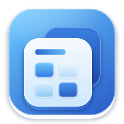
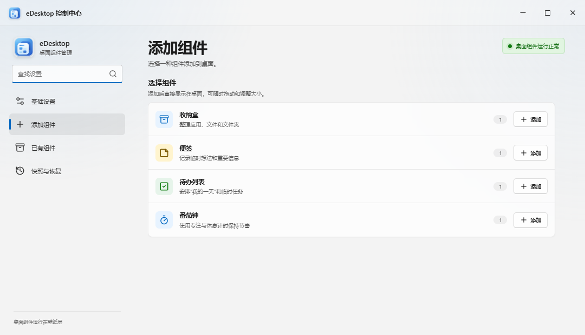
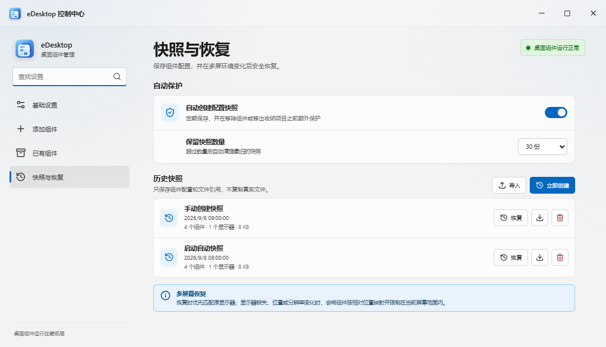
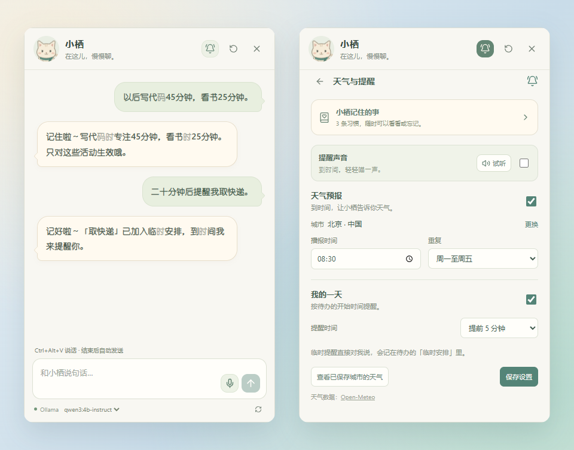
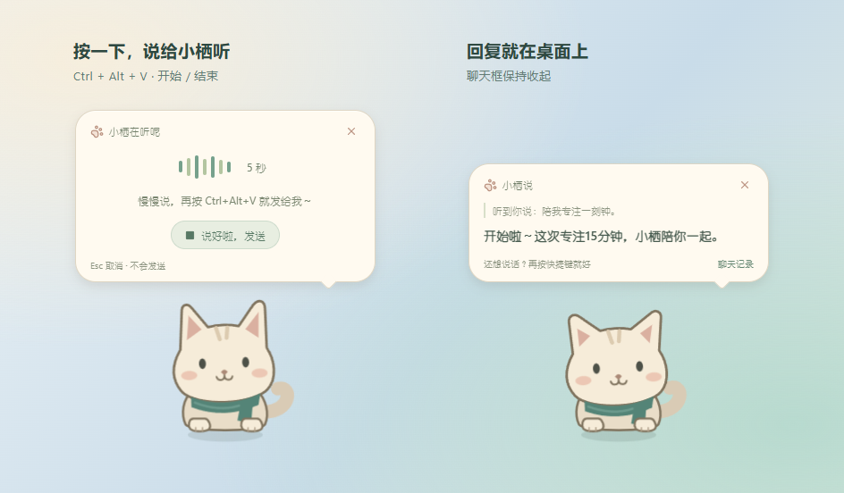
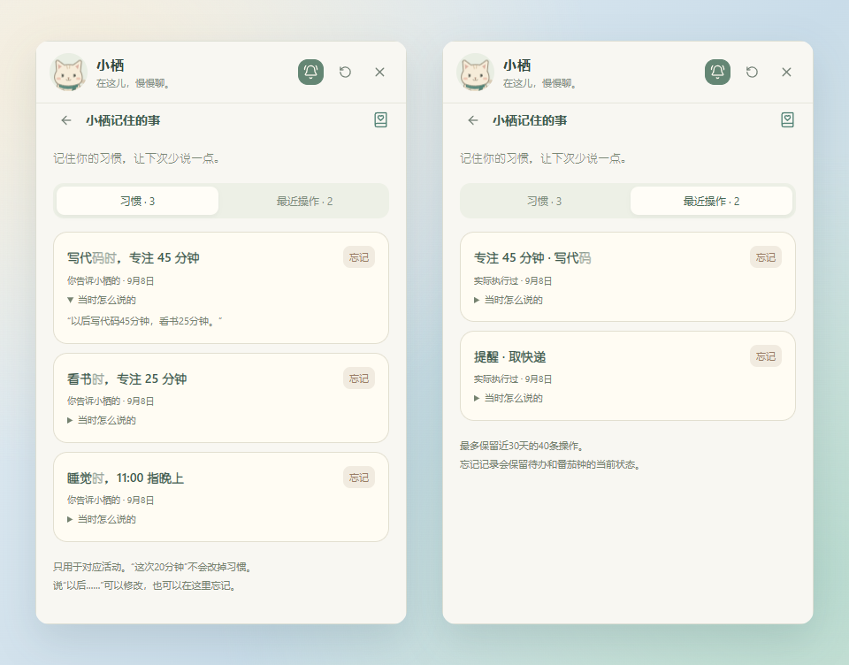

<p align="center">
  
</p>

<h1 align="center">eDesktop</h1>

<p align="center"><strong>让桌面清爽一点，也热闹一点。</strong></p>
<p align="center">桌面收纳 · 便签待办 · 番茄钟 · 小栖陪伴</p>

<p align="center">
  <a href="https://github.com/six486486/eDesktop/releases/latest"></a>
  
  <a href="LICENSE"></a>
</p>

<p align="center">
  <a href="https://github.com/six486486/eDesktop/releases/latest"><strong>下载体验</strong></a> ·
  <a href="#界面一览">界面一览</a> ·
  <a href="#小栖可以帮什么忙">认识小栖</a> ·
  <a href="#从源码运行">从源码运行</a> ·
  <a href="https://github.com/six486486/eDesktop/issues">反馈问题</a>
</p>

<br>


<p align="center"><sub>文件有地方放，事情有地方记，还有一只小猫陪着你。</sub></p>

我写 eDesktop 的初衷很简单：桌面文件越来越多，但我不想为了整理它们不停打开资源管理器。于是有了收纳盒、便签、待办和番茄钟，后来又住进来一只叫“小栖”的桌宠。

## 下载体验

在 [Releases](https://github.com/six486486/eDesktop/releases/latest) 下载 Windows x64 便携 ZIP，**完整解压，运行 `eDesktop.exe`**。整个文件夹都要保留。

- **桌面组件直接可用。** 从系统托盘打开控制中心，就能添加组件、调整设置。
- **想和小栖说话**：先安装并启动 [Ollama](https://ollama.com/)，准备一个聊天模型，小栖会自动连接本机默认服务。
- **想用语音**：按 `Ctrl+Alt+V`。首次下载约 229 MB 的离线识别模型，之后无需 API Key；下载完成后再按一次开始录音。

从旧版升级前，先从托盘正常退出，替换程序文件时 **保留自己的 `data` 文件夹**。当前版本没有商业代码签名，Windows 可能显示 SmartScreen 提示；请从本仓库下载，并核对 Release 附带的 SHA-256。

## 界面一览

| 整理桌面 | 安排一天 | 小栖陪伴 |
| --- | --- | --- |
| 收纳文件、文件夹、快捷方式和系统图标；拖动排序，双击打开。 | 便签随手记，待办分组安排，番茄钟专注与休息。 | 天气播报、到点提醒、语音操作，记住明确告诉它的习惯。 |

组件可以自由拖动、缩放，也能跨显示器摆放。截图均由当前程序界面渲染，使用独立演示数据；文件、对话、提醒和记忆都是示例。

### 一个控制中心，管好桌面

开关组件、创建收纳盒、调整桌宠和管理快照，都在这里完成。


<details>
<summary><strong>展开看看：添加组件、分组管理、快照与恢复</strong></summary>

**添加组件** · 选一种，放到桌面上。



**分组管理** · 按类型找到组件，改名、隐藏或移除。


**快照与恢复** · 保存布局和配置，需要时找回来。



</details>

## 小栖可以帮什么忙

已有的待办和番茄钟照常点击使用，手上正忙时，也可以直接说一句。小栖的开关在 **控制中心 → 基础设置 → 桌宠小栖**。

### 说一句，帮你记好

“二十分钟后提醒我取快递”会写进待办的“临时安排”。接着说“还是改成半小时吧”，修改的就是刚才那条提醒。

点击聊天窗口的小铃铛，可以设置天气城市、播报时间、“我的一天”提前多久提醒，以及是否带一声短短的“喵”。这些设置也能用自然语言修改。



### 不用打开聊天框，也能说话

按 **Ctrl+Alt+V** 开始说话，再按一次结束并自动发送。小栖竖耳听，声波随音量变化，回复直接出现在桌面气泡里。按 **Esc** 或点 × 可以取消，每次最多录音一分钟。



例如说“陪我专注一刻钟”，就能启动番茄钟。专注和休息结束时都有提醒，声音可以关闭。番茄钟目前支持立即开始、停止和查询，暂不支持预约未来开始。

### 记住有用的，也能随时忘记

“以后写代码45分钟，看书25分钟”，下次就能沿用。说“这次20分钟”只影响当前操作，不会覆盖习惯。

小铃铛 → **小栖记住的事**，能查看习惯、最近操作和当时的原话，也能逐条忘记。忘记操作记录不会删除真实待办或停止番茄钟。



尚未说完整的提醒也能接着补充：“提醒我取快递” → “二十分钟后”。这类临时上下文保留 30 分钟，重新聊或重启后清除，已经保存的提醒仍以待办时间为准。

<details>
<summary><strong>再试试这些说法</strong></summary>

| 想做什么 | 可以这样说 |
| --- | --- |
| 设置天气播报 | 每天早上八点半播报北京天气。 |
| 修改播报 | 天气改成九点，周末不用报。 |
| 临时提醒 | 11点提醒我上床睡觉。 |
| 推迟提醒 | 刚才那个，再推迟十分钟。 |
| 开始专注 | 陪我写会儿代码，这次20分钟。 |
| 查看过去的操作 | 上次写代码计时多久？ |
| 忘记习惯 | 忘掉写代码的习惯。 |

</details>

自然语言理解的效果取决于所选模型，请以小栖的实际回执和组件状态为准。手动设置与已保存的提醒不需要聊天模型一直运行；天气查询需要网络。应用退出或桌宠关闭期间不会弹出提醒。

## 数据留在自己手里

设置、待办、聊天、记忆、缓存和离线语音模型都在 **程序旁的 `data` 文件夹**。软件放在哪个盘，这些数据就跟到哪个盘。Ollama 的聊天模型由它独立管理。

录音只在内存中处理，不保存音频；识别后的文字按聊天记录保存在本地。对话发送到本机 Ollama，使用本地模型时推理在本机完成。天气服务会收到搜索的城市名或所选城市的经纬度；首次语音模型下载来自 ModelScope，并进行文件校验。

**收纳盒移动的是真实文件**，位置仍是 `%USERPROFILE%\Documents\eDesktop\收纳文件`。正常退出会尽量放回原处，遇到同名文件不会直接覆盖；配置快照不复制文件内容，不能替代备份。

<details>
<summary><strong>数据目录与升级说明</strong></summary>

```text
eDesktop-win32-x64/
  eDesktop.exe
  data/
    desktop-workspace.json
    desktop-pet/
      state.json
      speech/sensevoice/model.int8.onnx
```

从旧 AppData 目录升级时，新版会在首次初始化时自动复制、校验并迁移数据；已有 `data` 优先使用。目标文件夹不可写时会提示移动软件，不会换回 C 盘保存。

更新前先从托盘退出，替换程序文件时保留 `data`；移动软件时携带整个文件夹。如果开启了开机启动，移动后请关闭一次再重新开启，让 Windows 记录新路径。

`data` 含有个人内容，不要随软件转发或上传到 Issue。仓库和官方便携 ZIP 都不附带这份数据。反馈问题时，请遮住截图里的私人文件名与待办。

</details>

## 从源码运行

需要 Node.js 20 或更高版本，技术栈是 Electron、React、TypeScript 和 Vite。

```powershell
git clone https://github.com/six486486/eDesktop.git
cd eDesktop
npm install
npm run dev
```

| 命令 | 用途 |
| --- | --- |
| `npm run dev:pet` | 单独预览小栖，使用隔离工作区 |
| `npm run build` | 类型检查与前端构建 |
| `npm run package:portable` | 生成 Windows 便携 ZIP |
| `node --test desktop-pet/tests/*.test.cjs` | 桌宠自动化检查 |
| `npm run test:portable-data` | 数据目录与迁移检查 |

打包前请退出正在运行的 eDesktop。脚本会暂存并恢复输出目录中的 `data`，分发包不包含个人数据。源码启动默认使用项目根目录的 `data`。

<details>
<summary><strong>桌面与多屏相关检查</strong></summary>

```powershell
npm run test:desktop-host
npm run test:organizer-promotion
npm run test:snapshots:integration
npm run test:restore-guardian
npm run test:widget-model
npm run test:pomodoro-timing
npm run test:pomodoro-flip
```

桌面窗口、Explorer 图标位置和多屏缩放涉及 Windows 原生接口，修改后还需要在真实多屏环境下检查。

</details>

## 小栖背后的实现

本地 LLM 理解语义，运行层检查工具权限、参数来源和实时状态，保存成功后才给出真实回执。每轮请求都有独立标识，新消息可以打断旧回复，迟到结果不能覆盖新状态。记忆带有原话来源与有效期，操作记录和业务数据一起提交；到点提醒由程序调度，不需要反复询问模型。

[桌宠实现说明](desktop-pet/README.md) · [任务记忆设计](desktop-pet/TASK_MEMORY.md) · [截图制作说明](docs/screenshots/README.md)

## 一起把它做得顺手些

遇到问题欢迎提 [Issue](https://github.com/six486486/eDesktop/issues)，说说当时做了什么、出现了什么。涉及多屏或图标恢复时，附上 Windows 版本、屏幕分辨率和缩放比例会很有帮助。

也欢迎 Pull Request。尽量一次解决一个问题，方便检查和回退。

[MIT License](LICENSE) · [猫叫音效与 CC0 许可](desktop-pet/sounds/LICENSE.txt)
