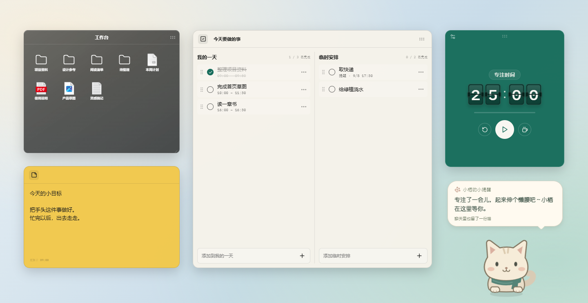
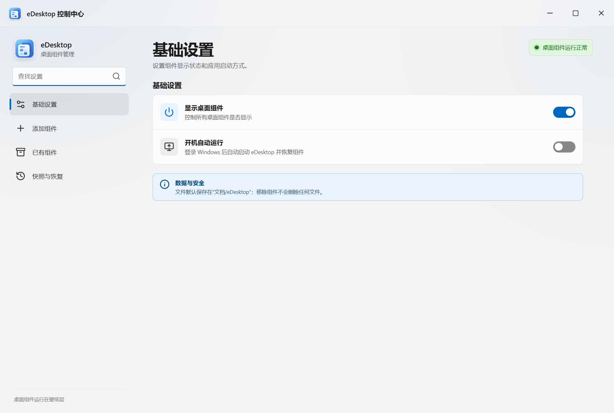
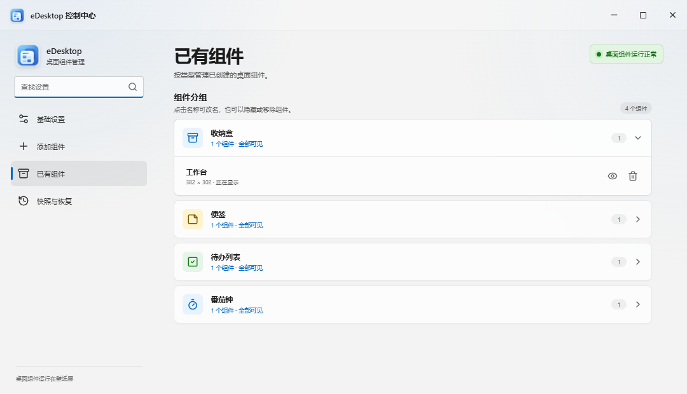

# eDesktop

eDesktop 是一个 Windows 桌面整理工具。我写它的初衷很简单：桌面上的文件越来越多，但我又不想为了整理文件不停地打开资源管理器。

它可以把文件、快捷方式和常用的系统图标放进桌面收纳盒，也提供便签、待办和番茄钟。后来，我又给它加了一只叫“小栖”的桌宠：平时安静待在桌面，到了时间提醒一句，需要时也能听你说话，帮忙记个待办、开个计时。

## 界面预览

桌面组件可以独立摆放。



创建组件、修改设置和管理快照都在控制中心完成。



已有组件按类型归类，组件多的时候也方便查找。



## 桌面整理

- 用收纳盒整理文件、快捷方式和文件夹，也支持“此电脑”“回收站”“网络”等系统图标
- 单击选中、双击打开、右键操作；项目可以在收纳盒之间拖动和排序
- 添加便签、待办列表和番茄钟，拖动、缩放或跨显示器摆放
- 待办分为“我的一天”和“临时安排”，支持时间设置、排序、跨分组拖动和每日重置
- 保存配置快照，恢复组件布局与内容
- 支持开机启动，也可以暂时隐藏全部桌面组件

## 小栖可以帮什么忙

我希望它是一只用起来顺手的小桌宠。已有的待办和番茄钟照常点击使用，手上正忙时，也可以直接说一句。

| 想做的事 | 可以这样用 |
| --- | --- |
| 出门前听听天气 | 点聊天窗口的小铃铛，选城市和播报时间；也能说“每天早上八点半播报北京天气” |
| 别忘了手头的安排 | “我的一天”按开始时间提醒，默认提前 5 分钟，可以调整或关闭 |
| 临时记一件事 | “二十分钟后提醒我取快递”，会写入待办的“临时安排” |
| 换个提醒时间 | 接着说“还是改成半小时吧”；“再推迟十分钟”则从原来的提醒时间往后推 |
| 开个番茄钟 | “陪我专注一刻钟”，也可以让它停止计时或查询剩余时间 |
| 记住常用时长 | “以后写代码45分钟，看书25分钟”；之后说“陪我写会儿代码”就能用上 |

专注和休息结束时，小栖都会通过气泡提醒。提醒可以带一声短短的“喵”，不想听时在小铃铛里关闭即可。天气城市、播报时间和提醒设置也都能在界面里直接修改。

**语音输入：**按 **Ctrl+Alt+V** 开始说话，再按一次结束并自动发送。聊天框保持收起，小栖会竖耳听，声波随音量变化，回复直接出现在气泡里。按 **Esc** 或点 × 可以取消，也可以使用聊天框内的麦克风按钮。每次录音最多一分钟。

第一次使用语音会下载约 229 MB 的离线识别模型，下载完成后再按一次快捷键即可录音，不需要 API Key。语音识别与命令理解是两件事：声音先在本机转成文字，再由 Ollama 中的聊天模型理解并调用工具。

**记忆可以自己管：**点击小铃铛 → **小栖记住的事**，能看到活动习惯、最近操作，以及当时的原话，也可以逐条忘记。说“这次20分钟”只影响当前操作，不会覆盖长期习惯；忘记一条操作记录，也不会删掉真实待办或停止番茄钟。

尚未说完整的提醒也能接着补充，比如“提醒我取快递” → “二十分钟后”。这类临时上下文保留 30 分钟，重新聊或重启后清除；已经保存的提醒仍以待办里的时间为准。

## 下载和使用

目前支持 **Windows 10/11 x64**。在 [Releases](https://github.com/six486486/eDesktop/releases/latest) 下载便携 ZIP，完整解压后运行 `eDesktop.exe`。请保留整个文件夹，程序依赖的文件都在里面。

从系统托盘打开控制中心，可以新建组件、调整设置。桌宠开关位于 **控制中心 → 基础设置 → 桌宠小栖**。

小栖的对话和自然语言操作需要本机安装并启动 [Ollama](https://ollama.com/)，且已有聊天模型。它会连接默认本地服务，自动选择已有模型，也可以在聊天框底部切换。没有连接时，界面会显示原因。手动设置天气、已经保存的到点提醒不需要模型一直运行；查询天气需要网络。

自然语言理解的效果取决于所选模型。工具执行后，小栖会给出实际时间和结果，待办与番茄钟里也能直接核对。番茄钟目前支持立即开始、停止和查询，暂不支持预约未来开始。应用退出或桌宠关闭期间不会弹出提醒。

如果开启了开机启动，之后又移动了软件文件夹，请关闭一次开机启动再重新开启，让 Windows 记录新的路径。

当前版本没有商业代码签名，Windows 可能显示 SmartScreen 提示。请确认文件来自本仓库，并核对 Release 附带的 SHA-256。

## 数据放在哪里

软件设置、待办、聊天记录、记忆、浏览器缓存和离线语音模型，统一保存在 **程序旁的 `data` 文件夹**。软件放在哪个盘，这些数据就跟到哪个盘。

```text
eDesktop-win32-x64/
  eDesktop.exe
  data/
    desktop-workspace.json
    desktop-pet/
      state.json
      speech/sensevoice/model.int8.onnx
```

从旧版升级时，请先从托盘正常退出，再替换程序文件，**保留已有的 `data` 文件夹**。如果还在使用旧的 `%APPDATA%\eDesktop` 目录，新版会在首次初始化时自动复制、校验并迁移数据；已有 `data` 优先使用。目标文件夹不可写时会提示移动软件，不会偷偷换回 C 盘。

录音只在内存中处理，不保存音频文件；识别后的文字按普通聊天记录保存在本地。对话请求发送到本机 Ollama，使用本地模型时推理在本机完成。Ollama 的聊天模型由它独立管理，不在 eDesktop 的语音模型目录里。

联网部分主要是天气和首次模型下载：天气使用 Open-Meteo，会发送搜索的城市名称或所选城市的经纬度；语音模型从 ModelScope 下载，并校验文件大小与 SHA-256。

`data` 中包含个人内容，不要随软件转发或上传到 Issue。仓库和官方便携 ZIP 都不附带这份数据。提交问题时，贴复现步骤和必要的错误信息就好，截图中也请遮住私人文件名与待办。

### 关于收纳盒里的文件

把文件放进收纳盒时，eDesktop 会移动真实文件，存放位置仍然是：

```text
%USERPROFILE%\Documents\eDesktop\收纳文件
```

正常退出时，文件会尽量回到收纳前的位置；遇到同名文件不会直接覆盖。配置快照记录组件、设置和文件位置，不会复制文件内容，不能替代文件备份。这个收纳目录与程序旁的 `data` 分开管理。

## 从源码运行

需要 Node.js 20 或更高版本。项目使用 Electron、React、TypeScript 和 Vite。

```powershell
git clone https://github.com/six486486/eDesktop.git
cd eDesktop
npm install
npm run dev
```

源码启动默认使用项目根目录的 `data`。只想预览桌宠可以运行 `npm run dev:pet`，它使用隔离的测试工作区。

```powershell
npm run build                # 类型检查与前端构建
npm run package:portable     # Windows 便携 ZIP
```

打包前请从托盘退出正在运行的 eDesktop。脚本会暂存并恢复输出目录中的 `data`，分发包不包含个人数据。也可用 `package:win` 生成程序目录，或用 `make:win` 生成安装包。

常用检查：

```powershell
node --test desktop-pet/tests/*.test.cjs
npm run test:portable-data
npm run test:widget-model
npm run test:pomodoro-timing
npm run test:pomodoro-flip
```

桌面窗口、Explorer 图标位置和多屏缩放涉及 Windows 原生接口。修改这部分时，还需要运行 `test:desktop-host`、`test:organizer-promotion`、`test:snapshots:integration`、`test:restore-guardian`，并在真实多屏环境下检查。

## 小栖的实现

小栖用本地 LLM 理解语义，运行层负责决定这一轮能用哪些工具、检查参数、取消旧请求，并把结果保存到真实工作区。模型说“记好了”并不代表操作成功，界面的工具回执来自实际执行结果。

每轮请求有独立的运行标识；新消息可以打断旧回复，迟到的结果不能覆盖新状态。任务记忆带有原话来源和有效期，工具操作记录与业务数据一起提交。提醒调度由程序按时间执行，不需要反复询问 LLM。

具体设计、边界和测试入口见 [桌宠实现说明](desktop-pet/README.md) 与 [任务记忆设计](desktop-pet/TASK_MEMORY.md)。

## 参与项目

遇到问题可以提交 [Issue](https://github.com/six486486/eDesktop/issues)。涉及多屏、缩放或桌面图标恢复时，请附上 Windows 版本、各屏幕的分辨率与缩放比例，以及复现步骤。

也欢迎 Pull Request。尽量让一次提交只解决一个问题，方便检查和回退。

## License

[MIT](LICENSE)。内置猫叫音效的来源与 CC0 许可见 [音效说明](desktop-pet/sounds/LICENSE.txt)。
